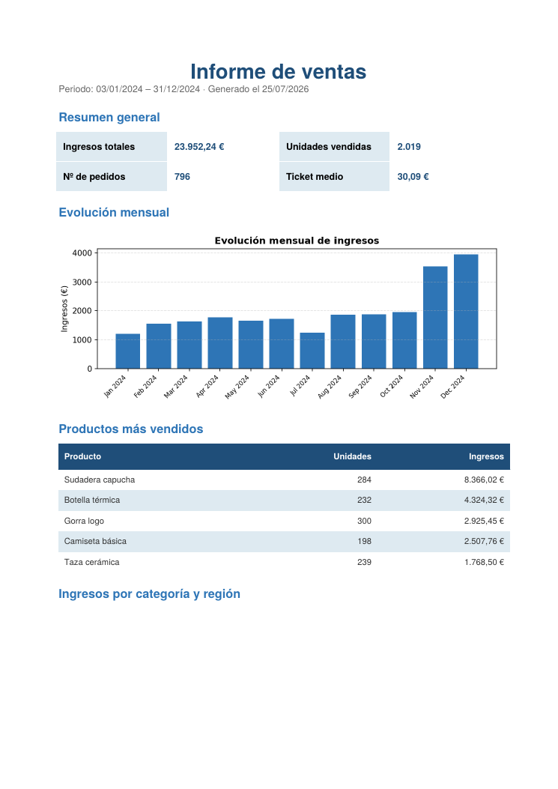

# 📊 Generador automático de informes de ventas

Convierte un archivo CSV de ventas en un **informe PDF profesional** con un solo comando. Pensado para pequeños negocios que generan el mismo informe manualmente cada semana o cada mes y quieren ahorrarse ese trabajo repetitivo.

> Le das los datos en bruto. Te devuelve un informe listo para presentar.

---

## ¿Qué problema resuelve?

Muchos negocios exportan sus ventas a un Excel/CSV y luego dedican **horas** a montar a mano el mismo informe: sumar ingresos, calcular el ticket medio, mirar qué productos van mejor, hacer un gráfico... cada semana, lo mismo.

Este script automatiza todo ese proceso: lee los datos, calcula los indicadores clave y genera un PDF con formato profesional en **segundos**.

## ¿Qué incluye el informe?

- **Indicadores clave**: ingresos totales, unidades vendidas, número de pedidos y ticket medio.
- **Gráfico de evolución mensual** de ingresos.
- **Ranking de productos** más vendidos.
- **Desglose de ingresos** por categoría y por región.

<p align="center">
  
</p>

## Cómo se usa

```bash
# 1. Instalar dependencias
pip install -r requirements.txt

# 2. Generar el informe (usa el CSV de ejemplo incluido)
python generar_informe.py

# También puedes indicar tu propio archivo y el nombre de salida:
python generar_informe.py mis_ventas.csv informe_marzo.pdf
```

## Formato del CSV de entrada

El archivo debe tener estas columnas (ver `datos_ventas.csv` como ejemplo):

| fecha | producto | categoria | region | unidades | precio_unitario |
|-------|----------|-----------|--------|----------|-----------------|
| 2024-01-05 | Camiseta básica | Ropa | Norte | 2 | 12.90 |

El script valida los datos automáticamente y avisa si faltan columnas o hay filas con valores incorrectos, sin romperse.

## Tecnologías

- **Python 3**
- **pandas** — procesamiento y agregación de datos
- **matplotlib** — generación del gráfico
- **reportlab** — maquetación del PDF

## Personalización

El informe está pensado para adaptarse fácilmente a cada cliente:
- Colores corporativos configurables en la parte superior del script (`COLOR_PRINCIPAL`, etc.).
- Fácil de ampliar con nuevas métricas, secciones o gráficos.
- Se puede conectar a una salida automática (por email, carpeta compartida, tarea programada...).

---

*Proyecto de ejemplo. ¿Necesitas una automatización a medida para tu negocio? Contacta conmigo.*
